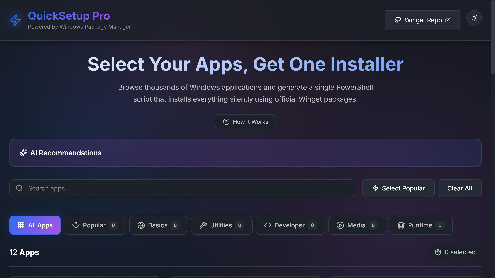

# QuickSetup Pro 🚀

[](https://tsotraki.github.io/quicksetup-pro/)

A modern Ninite-like web application for Windows that allows users to select multiple apps and generates a single installer script using Microsoft Winget.



## Features

- ✨ **Clean, Modern UI** - Beautiful interface with app icons and categories
- 🔍 **Smart Search** - Find apps quickly with real-time search
- 🤖 **AI Mode** - Describe your setup needs and get AI-recommended apps
- 📦 **Categories** - Organized into Basics, Utilities, Developer, Media, Runtime
- 🔒 **Secure** - Verifies installer hashes from official Winget repository
- ⚡ **Silent Installation** - No prompts, toolbars, or ads
- 🎯 **Smart Detection** - Skips already installed apps
- 📝 **PowerShell Script** - Generates ready-to-run installation script

## Tech Stack

- **Frontend**: React + TypeScript + Vite
- **Backend**: Node.js + Express
- **Styling**: Modern CSS with glassmorphism effects
- **Icons**: Lucide React
- **Animations**: Framer Motion
- **Package Manager**: Winget integration

## Project Structure

```
quicksetup-pro/
├── src/                    # Frontend React application
│   ├── components/         # React components
│   ├── services/          # API services
│   ├── types/             # TypeScript types
│   └── App.tsx            # Main app component
├── api/                    # Backend API (Vercel Functions)
│   ├── routes/            # API routes
│   ├── services/          # Business logic
│   └── main.ts            # API entry point
└── public/                # Static assets
```

## Getting Started

### Prerequisites

- Node.js 18+ and npm
- Windows 10/11 with Winget installed

### Installation

1. Clone the repository:
```bash
git clone <repository-url>
cd quicksetup-pro
```

2. Install dependencies:
```bash
npm install
```

3. Start development server:
```bash
npm run dev
```

This will start both the frontend (port 5173) and backend (port 3001).

### Build for Production

```bash
npm run build
```

## Usage

1. **Select Apps**: Browse categories or use search to find apps
2. **AI Mode** (Optional): Describe your setup (e.g., "Setup for web development")
3. **Generate Script**: Click "Generate Installer Script"
4. **Download & Run**: Download the PowerShell script and run as administrator

## API Endpoints

- `GET /api/apps` - Get all available apps
- `GET /api/apps/:id` - Get specific app details
- `POST /api/script/generate` - Generate installation script
- `POST /api/ai/recommend` - Get AI-recommended apps

## Security

- All apps are sourced from the official Microsoft Winget repository
- SHA256 hash verification for all installers
- No third-party or modified installers
- Open-source and transparent

## AI Recommendations

The AI recommendation feature uses **intelligent search** to find relevant apps for any keyword. It searches the entire Winget repository and scores results based on:

- **Name matching** - Exact or partial matches in app names
- **WingetId matching** - Matches in package identifiers  
- **Tags** - Relevant tags associated with the app
- **Description** - Keywords in app descriptions
- **Popularity** - Slight boost for popular apps

**How it works:**
1. Type any keyword (e.g., "browser", "compress", "photo editor", "game")
2. The system searches thousands of Winget packages
3. Results are ranked by relevance
4. Top 8 most relevant apps are selected automatically

**Example searches:**
- "compress" → 7-Zip, WinRAR, PeaZip, etc.
- "browser" → Chrome, Firefox, Edge, Brave, etc.
- "video editor" → DaVinci Resolve, Shotcut, HandBrake, etc.
- "python" → Python, VS Code, PyCharm, etc.
- "game" → Steam, Epic Games, GOG Galaxy, etc.

**Works with ANY keyword!** Just describe what you need and the AI will find relevant apps.


## Contributing

Contributions are welcome! Please feel free to submit a Pull Request.

## License

MIT License - See LICENSE file for details

## Acknowledgments

- Microsoft Winget team for the package manager
- Ninite for the inspiration
- Open-source community
